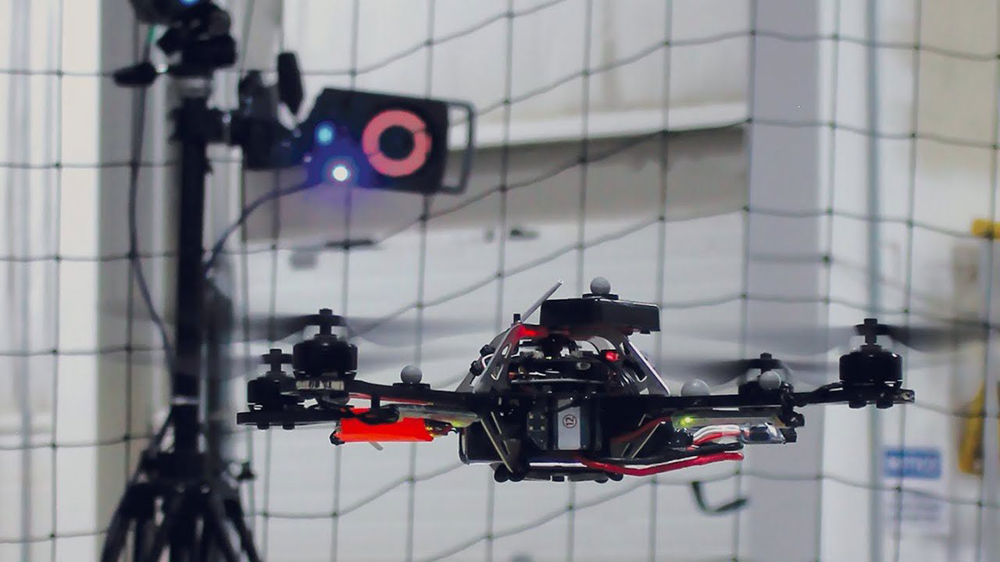
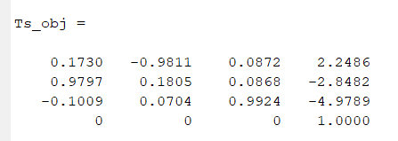

# ECE 555-01 HW#1  
  
Given a robot located at -2x + 3y + 5z with the following IMU orientation: Roll = 5 deg, Pitch = -5 deg, Yaw = 10 degrees. The robot has a sensor that is mounted 1 unit from its object z axis. The sensor detects an object with the following transformation.  

  
Determine the location and orientation of the object in reference the world coordinate system.  
* Draw a system Pose Graph
* Determine the Pose of robot w.r.t world
* Determine the Pose of the Sensor w.r.t robot
* Determine the Pose of the object w.r.t world
* Prove that the Rotations component is valid