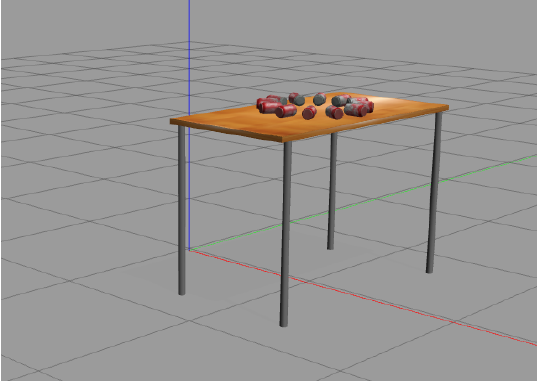
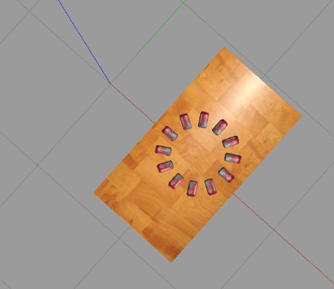
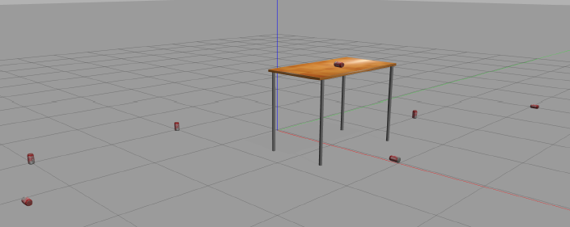

# ECE 555-01 HW#2

## Generating Launch Files

A launch file is used to configure and execute one or more ROS node(s). These nodes can be of mix types; example cpp
node and python node.
Use the following steps to create a launch files for this assignment

### Terminal 1

```commandline
mkdir -p ~/ros1_ws/src/robotics_module1/launch
touch module1.launch
```

Edit module1.launch

This script launch gazebo with an world defined in assignment1.world

## Generating Custom World

We will now generate a world file for this assigment using the following commands.

### Terminal 1

```commandline
mkdir -p ~/ros1_ws/src/robotics_module1/worlds
touch assignment1.world
```

Edit assignment1.world

```xml
<?xml version="1.0" ?>
<sdf version="1.4">
    <world name="default">
        <include>
            <uri>model://ground_plane</uri>
        </include>
        <include>
            <uri>model://sun</uri>
        </include>
        <include>
            <uri>model://table</uri>
            <name>table</name>
            <pose>1 0 0 0 0 1.57</pose>
        </include>
        <include>
            <uri>model://coke_can</uri>
            <name>coke_can1</name>
            <pose>2 0 1 0.24 0 1.57</pose>
        </include>
        <include>
            <uri>model://coke_can</uri>
            <name>coke_can2</name>
            <pose>1 2 0 0 0.35 1.57</pose>
        </include>
        <include>
            <uri>model://coke_can</uri>
            <name>coke_can3</name>
            <pose>0 0 5 1.57 0 1.57</pose>
        </include>
        <include>
            <uri>model://coke_can</uri>
            <name>coke_can4</name>
            <pose>2 4 0 1.57 0 1.57</pose>
        </include>
        <include>
            <uri>model://coke_can</uri>
            <name>coke_can5</name>
            <pose>3 0 6 0 1.57 1.57</pose>
        </include>
        <include>
            <uri>model://coke_can</uri>
            <name>coke_can6</name>
            <pose>6 4.6 0 0 0 1.57</pose>
        </include>
        <include>
            <uri>model://coke_can</uri>
            <name>coke_can7</name>
            <pose>1 0 7 .45 0 1.57</pose>
        </include>
        <include>
            <uri>model://coke_can</uri>
            <name>coke_can8</name>
            <pose>6 2 1 0 0.27 1.57</pose>
        </include>
        <include>
            <uri>model://coke_can</uri>
            <name>coke_can9</name>
            <pose>-1 -3 0 0 0 1.57</pose>
        </include>
        <include>
            <uri>model://coke_can</uri>
            <name>coke_can10</name>
            <pose>-3 -4 0 1.57 0 1.57</pose>
        </include>
        <include>
            <uri>model://coke_can</uri>
            <name>coke_can11</name>
            <pose>-1 -1 0 0 0 1.57</pose>
        </include>
        <include>
            <uri>model://coke_can</uri>
            <name>coke_can12</name>
            <pose>0 -4 0 0 1.57 1.57</pose>
        </include>
    </world>
</sdf>
```

## Module 1 Assignment

Estimated time to completion: ~ **2 hours**
In this Module, you will learn the basic concepts for representing the position and orientation of rigid bodies in 3D:
* Frames of reference
* Representing positions
* Representing rotations
* Rotational transformations
* Composition of rotations
* Parameterization of rotations
* Homogeneous transformation matrices

In the final exercise of this unit, you have to properly position and orient the elements of the scene below:  

 

The below code spawns the table and Coke cans. Each can must have a different model name: we use the names coke_can_n with between 0 and 11.  

**Before spawning the objects, let's restart the physics of the simulator for to have more fun!**  


Create a file in the `ros1_ws/src/robotics_module1` directory, named `setup_table.cpp`, and add the below code:  

[Add this code to *setup_table.cpp*](setup_table.cpp)

And execute the script in terminal 1:

```commandline
roslaunch robotics_module1 module1.launch
```

After running the code, you will have something like this:



Add the necessary code for properly positioning and orienting the requested elements.  

The table is moved from the orgin to an initial position of **_(x = 1, y= 0 , z = 0)_** and rotated 90º about the z-axis.

The cans are positioned in a circle with a radius 0.2 centered in **_(x = 1, y= 0 , z = 1.05)_** (in the middle of the table, a bit on top of it). Each can is rotated twice: first, a rotation about the z-axis, proportional to its angle in the circle; second, 90º about each can's y-axis, so they lay on the table, in
a star-shaped pattern.

Execute *terminal 2

```commandline
rosrun robotics_module1 setup_table
```
