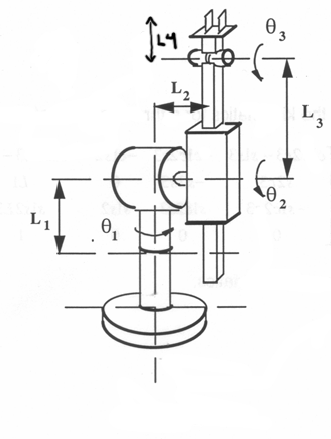

# ECE 555 HW#4

1. The Figure below is a RRPR robot. For this robot system:
* Assign link frames
* Complete the Denavit-Hartenberg parameters
* Use the link parameters to compute the individual link transformation matrices for each joint and compute the individual transformation matrices

2. Write a MATLAB script using the Robotics Toolbox to determine the location and orientation of the manipulator’s end-effector where:

* Theta1, Theta2, and Theta 3 are 0  
* All links are 1 unit

