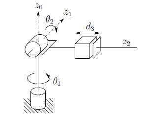
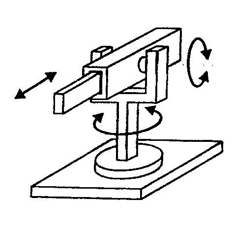

# ECE 555 HW#5

The Figure below is an RRP robot. For this robot system:

1. D-H Parameters
2. Determine the symbolic tool-tip velocities using partial differential equations
3. Determine the symbolic tool-tip linear and angular velocities using the O and Z vector from the A Matrix.
4. For the robot configuration shown below, where all the links are 1 unit and Theta1 and Theta2 is at zero degrees, determine the numerical Jacobian Matrix.
5. Determine the inverse Jacobian for the Matrix found in Question 4.
6. Write a MATLAB script to solve for the inverse kinematics, (q1, q2, q3) to position the robot at 0.25x + 0.25y + 1.354z.
 
  